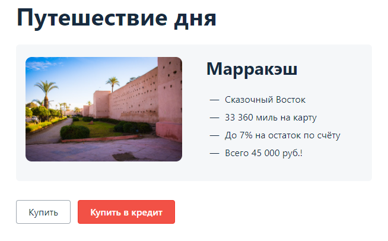
# План автоматизации тестирования сервиса "Путешествие дня"

## Перечень автоматизируемых сценариев

### Для автоматизации тестов необходимо автоматизировать не только сам ввод валидных/невалидных данных, но и дейсвтия для перехода на страницу сервиса и выбора способа оплаты.  
---
> Покупка по дебетовой карте с вводом валидных/невалидных данных.  
> 
> переход на сайт http://127.0.0.1:8080  
> выбор типа оплаты - кнопка <Купить>  
> 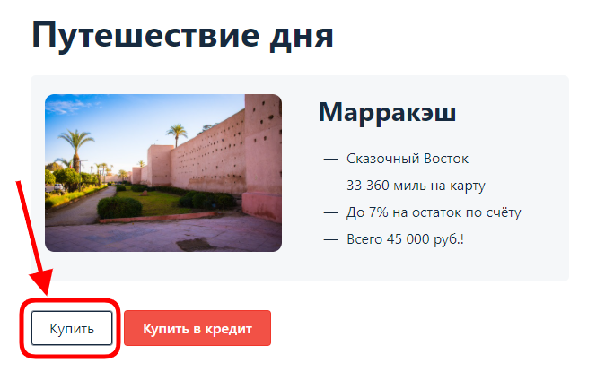  
> ввод данных (валидных и невалидных, включая "разрешенные" и "запрещенные" карты банком)  
> 

> 
развернуть список:
  
> 
> ввод номера карты  
> 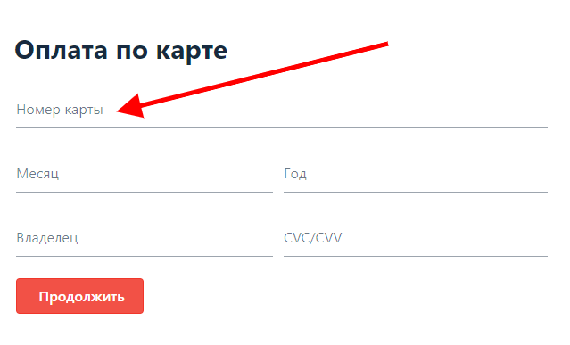
>  
> ввод срока действия карты (месяц)  
> 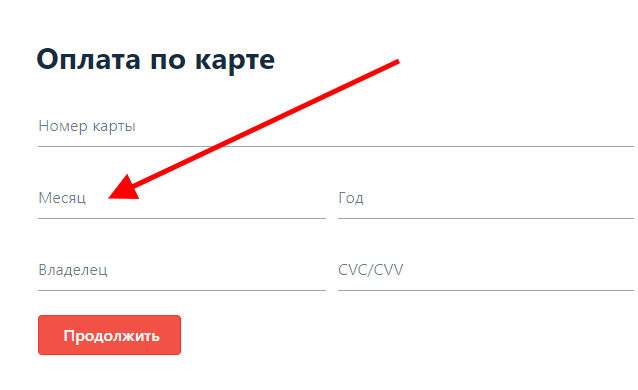
> 
> ввод срока действия карты (год)  
> 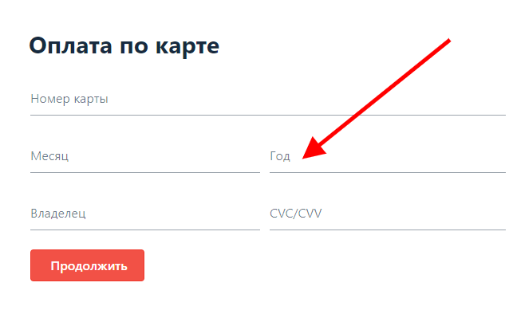
> 
> ввод имени владельца карты  
> 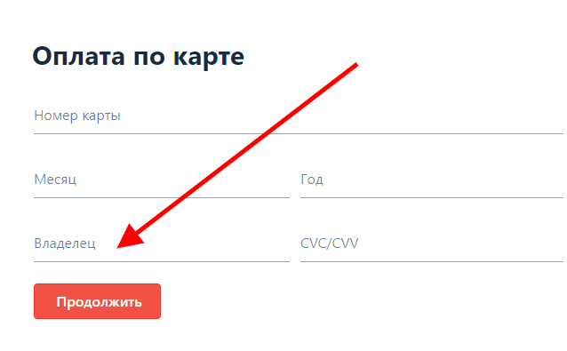
> 
> ввод CVC/CVV кода карты  
> 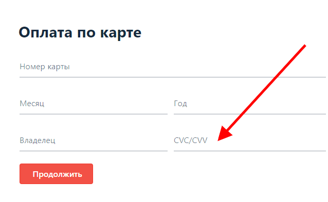
> 
> нажать кнопку <Продолжить>  
> 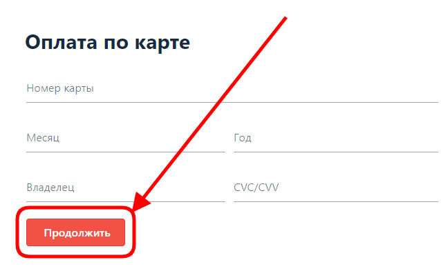
> 
> дождаться ответа от банка с результатом покупки  
> 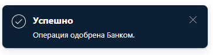  
> или  
> 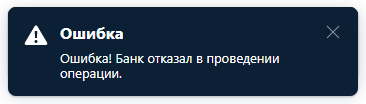
> 
    
--- 

---
> Покупка в кредит с вводом валидных/невалидных данных.  
> 
> переход на сайт http://127.0.0.1:8080  
> выбор типа оплаты - кнопка <Купить>  
> 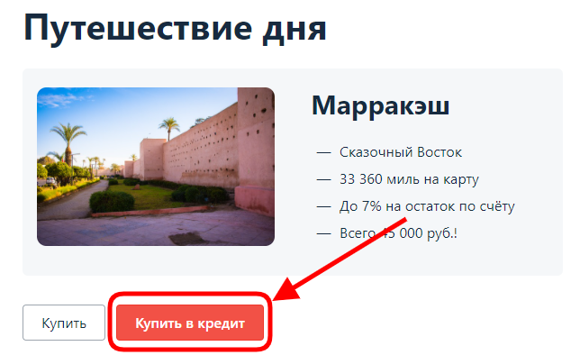  
> ввод данных (валидных и невалидных, включая "разрешенные" и "запрещенные" карты банком)  
> 

> 
развернуть список:
  
> 
> ввод номера карты  
> 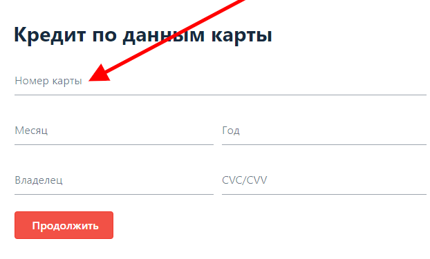
>  
> ввод срока действия карты (месяц)  
> 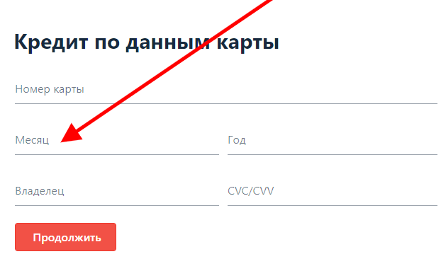
> 
> ввод срока действия карты (год)  
> 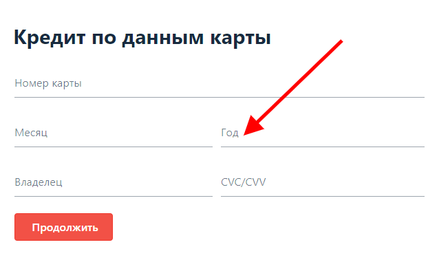
> 
> ввод имени владельца карты  
> 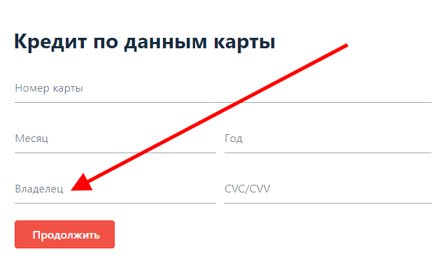
> 
> ввод CVC/CVV кода карты  
> 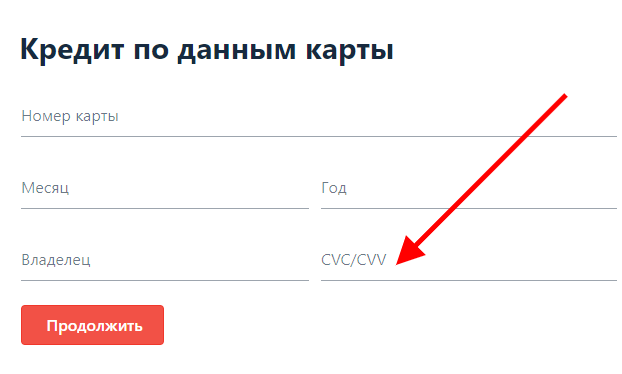
> 
> нажать кнопку <Продолжить>  
> 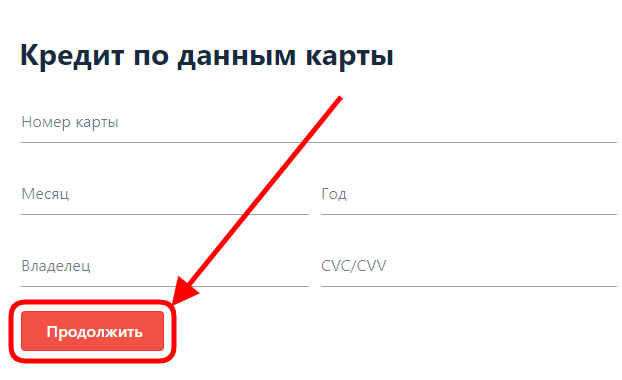
> 
> дождаться ответа от банка с результатом покупки  
>   
> или  
> 
> 
    
---

### Для тестирования сервиса необходимо провести ряд тестов на позитивные и негативные сценарии.

#### Позитивные сценарии  
(т.к. требований к полям у нас нету, мы будем использовать в плане условные, рекомендуемые требования к полям)  
- для проверки поля номера карты необходимо использовать те номера карт, что нам предоставили:
	- номер разрешенной карты: 4444 4444 4444 4441
	- номер не разрешенной карты: 4444 4444 4444 4442
	- так же возьмем дополнительно тестовую карту для дополнительной проверки
- заполнить поле "месяц" (вводим данные в двухзначном формате от 01 до 12)
- заполнить поле "год" (вводим последние 2 цифры года в интервале от текущего до +5)
- вводим данные владельца (данные вводят на английской раскладке, транслитом)
	- минимум 2 буквы
	- использование пробела
	- использование точки
	- использование дефиса(тире)
- вводим код CVC/CVV (трехзначный код)
    
#### Негативные сценарии

##### ВАЖНО!!! при проверке одного поля на негативные сценарии, все остальные поля должны быть заполнены валидными данными!!!  
Поле номер карты. В данном сервисе используется формат карты из 16 цифр, но так же в мире могут быть карты с другим количеством цифр в номере(13,15,18 и 19). Т.к. не достаточно требований по данному сервису, мы будем проводить негативные сценарии на номерах карт из 16 цифр:
- пустое поле (система не должна разрешать отправлять форму с пустым полем)
- использование букв в поле (не допускать использовать при заполнении поля буквы)
- спецсимволы типа !"№;%:? и т.д. (не допускать использование спец символов)
- номер карты содержащий менее 16 цифр (должны получать сообщение о не правильном формате)
- номер карты содержащий более 16 цифр (поле не должно позволять вводить более 16 цифр карты)

Поле месяц:
- пустое поле (система не должна разрешать отправлять форму с пустым полем)
- использование букв в поле (не допускать использовать при заполнении поля буквы)
- спецсимволы типа !"№;%:? и т.д. (не допускать использование спец символов)
- граничные значения 00 и 13. А так же последующий номер месяца, от текущего при крайнем валидном значении в поле "год" (прим. если срок годности карты +5, то номер месяца не должен превышать текущего)

Поле год:
- пустое поле (система не должна разрешать отправлять форму с пустым полем)
- использование букв в поле (не допускать использовать при заполнении поля буквы)
- спецсимволы типа !"№;%:? и т.д. (не допускать использование спец символов)
- год истекшего срока карты
- год превышающий более 5 лет от текущей даты.

Поле Владелец:
- пустое поле (система не должна разрешать отправлять форму с пустым полем)
- использование цифр в поле (не допускать ввода при заполнении поля цифрами)
- спецсимволы типа !"№;%:? и т.д. (не допускать использование спец символов(кроме дефиса(тире), точки "." и пробела)
- использование русских символов (система не должна разрешать отправлять форму с русскими символами)

Поле CVC/CVV
- пустое поле (система не должна разрешать отправлять форму с пустым полем)
- спецсимволы типа !"№;%:? и т.д. (не допускать ввода спец символов)
- использование букв (не допускать ввода букв)
- код состоящий из менее чем 3х цифр
- код состоящий из более чем 3х цифр

##### при проверке на негативные сценарии должны получать соответствующие сообщения об ошибке у каждого из проверяемых полей:
- Номер карты: Неверный формат
- Месяц: Неверно указан срок действия карты / Неверный формат
- Год: Неверно указан срок действия карты / Неверный формат
- Владелец: Поле обязательно для заполнения / Неверный формат
- CVC/CVV: Неверный формат
---

## Перечень используемых инструментов

### Docker-compose
Инструмент для создания и запуска многоконтейнерных Docker приложений. В Compose, используется специальный файл для конфигурирования тестируемых сервисов приложения. Compose превосходен для разработки, тестирования и настройки среды, а также непрерывной интеграции.

### IntelliJ IDEA
Несмотря на то, что IntelliJ IDEA — в первую очередь IDE для Java, она понимает и предоставляет интеллектуальную помощь при написании кода на SQL, JPQL, HTML, JavaScript и многих других языках и позволяет редактировать код, написанный не на Java, внутри строковых литералов Java-кода.

### Java 11
Java — едва ли не единственный язык, на свежих версиях которого можно запускать код, написанный 25 лет назад. Разработчики языка очень серьезно относятся к обратной совместимости, поэтому многие организации выбирают Java в качестве основной технологии, зная, что старый код будет запускаться на JVM еще долгие годы.
Сам язык и решения, которые он предлагает, хорошо документированы и поддерживаются вендорами и некоммерческими организациями, а также отдельными пользователями.

### Gradle
Альтернатива Maven, но:
  - скрипты сборки на Gradle на много короче и удобнее в написании
  - Gradle быстрее maven
  - Gradle был создан для расширяемых многопроектных сборок, и поддерживает инкрементальные сборки, определяя, какие компоненты дерева сборки не изменились и какие задачи, зависимые от этих частей, не требуют перезапуска.
  - в Gradle собраны лучшие качества от Maven и Ant
  - Gradle легко масштабируется
### JUnit 5
  - На сегодняшний день это самая популярная платформа автоматизированного тестирования в мире Java. Как JUnit, так и TestNG поставляются вместе с IntelliJ IDEA: предполагается, что для любого нового Java-проекта необходим фреймворк тестирования. Вполне вероятно, что современные тестовые фреймворки для самых разных языков основаны на идеях, впервые реализованных в JUnit. Культура автоматизированного тестирования, принятая в Java-сообществе, во многом обязана именно этой библиотеке.
  - В виду популярности данной платформы, много поддерживаемых модулей и документации.
### Selenide
  - это обёртка вокруг Selenium WebDriver, позволяющая быстро и просто его использовать при написании тестов, сосредоточившись на логике, а не суете с браузером.
### Lombok
  - библиотека, с помощью которой мы можем сократить количество шаблонного кода, который нужно писать на Java.
### JavaFaker (на усмотрение)
  - библиотека, которую можно использовать для создания широкого спектра реально выглядящих данных.
  - это хороший модуль, но я бы написал свой список данных, что бы быть уверенным в минимизации рисков при вводе валидных данных.

## Перечень необходимых разрешений/данных/доступов
- В случае с проверкой поля "номер карты" необходимо от заказчика получить информацию, каких форматов обслуживаются карты в данном сервисе (13,15,16,18 и 19 цифр в номере карты)

## Перечень и описание возможных рисков при автоматизации
- Изменнеие элементов в коде может повлиять на работу автотестов и в конечном счете их придется править/чинить.
- Увеличение времени на тестирование и его стоимость. (Автоматизация тетов имеется смысл, только если проверка модуля будет необходима с какой-то периодичностью.)

## Перечень необходимых специалистов для автоматизации
Для написания автотестов на данный модуль потребуется 1 специалист QA

## Интервальная оценка с учётом рисков (в часах)
Для выполнения автоматизации тестирования, с учетом рисков, потребуется от 3 до 5 рабочих дней, в зависимости от квалификации специалиста QA и нагрузки по другим проектам.