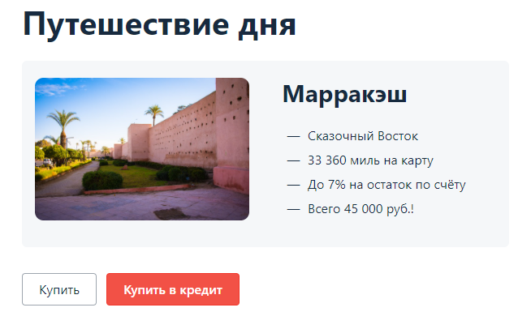

# Инструкция по запуску и тестированию сервиса "Путешествие дня"

## Docker-Compose
Для работы с docker-compose, нам потребуется установленный Docker.
Рекомендую воспользоваться инструкцией по установке от сюда: [установка Docker](https://github.com/netology-code/aqa-homeworks/blob/master/docker/installation.md)

Так же, рекомендую установить дополнительно в IntelliJ IDEA плагин "docker":

Откройте IntelliJ IDEA, перейдите в раздел настроек:

Windows/Linux: File -> Settings
MacOS: IntelliJ IDEA -> Preferences

Найдите в поиске раздел Plugins -> перейдите на вкладку MarketPlace -> введите в поиске docker -> нажмите install возле найденного плагина:


Теперь можно редактировать конфигурации, запускать и останавливать контейнеры/ПО из IntelliJ IDEA.

## Открываем наш проект в IntelliJ IDEA, и приступаем к запуску и тестированию сервиса.

### Запуск БД через docker-compose  
В корне проекта лежит файл docker-compose.yml, в котором описаны инструкции по запуску.  
Все что Вам необходимо, это запустить его командой, находясь в этом же каталоге:  
```docker-compose up```  
после запуска, можно проверить статус контейнеров, запущены они или нет:  
```docker-compose ps```  
вы увидите список запущенных процессов:  


### Запуск Сервиса "Путешествие дня"

Приложение находится в папке ```artifacts\```. переходим в каталог:  
```cd artifacts\```  
И запускаем его командой:  
```java -jar aqa-shop.jar```

Сервису, для нормальной работы необходим файл конфигурации ```application.properties``` который имеет ряд настроек:
- учётные данные и url для подключения к СУБД
- url-адреса банковских сервисов  
```
spring.credit-gate.url=http://localhost:9999/payment  
spring.payment-gate.url=http://localhost:9999/credit  
spring.datasource.url=jdbc:mysql://localhost:3306/app  
spring.datasource.username=app  
spring.datasource.password=pass  
```
В данном случае, приложение настроено на работу с базой данных MySql. для того что бы оно работало с базой данных postgre, необходимо заменить строку ```spring.datasource.url=jdbc:mysql://localhost:3306/app``` на ```spring.datasource.url=jdbc:postgresql://localhost:5432/app```
и перезапустить сервис(в окне, в котором запускали сервис нажать ctrl+C, дождаться остановки сервиса, и заново запустить командой ```java -jar aqa-shop.jar```).

P.S.: не забудьте о IP-адресе вашего докера. Если он отличается от localhost(127.0.0.1), замените на тот, что у вас. Проверить IP-адрес можно из командной строки вашей операционной системы(или в терминале IntelliJ IDEA): ```docker-machine ip default```  
  
Так же, необходимо изменить IP адрес, если он отличается от localhost(127.0.0.1), в файле DataHelper.java (путь до файла: src\test\java\ru\netology\web\data) в двух строках:
```
    private String urlMsSql = "jdbc:mysql://localhost:3306/app";  
    private String urlPostgre = "jdbc:postgresql://localhost:5432/app";
```

А так же необходимо соединение с базой данных, которое мы запустили ранее, и симулятор банковских сервисов.

### Запуск симулятора банковских сервисов.
Данный симулятор находится в папке ```api```  
Для его запуска необходимы docker-compose.yml(инструкции для запуска симулятора) и Dockerfile(конфигурационный файл в котором содержатся команды для сборки образа)  
Запускаем симулятор: 
- переходим в папку ```cd api\```  
- запускаем docker ```docker-compose up```  
- смотрим статус ```docker-compose ps```  
  

### Автотесты.  
В данном проекте имеется 4 класса тестов. по 2 на каждую базу данных:  
- ```ServicePaymentTest.java``` (здесь находятся тесты сервиса по "покупке" и работе с БД MySql)
- ```ServiceCreditTest.java``` (здесь находятся тесты сервиса по "покупке в кредит" и работе с БД MySql)
- ```ServicePaymentPostgreTest.java``` (здесь находятся тесты сервиса по "покупке" и работе с БД Postgre)
- ```ServiceCreditPostgreTest.java``` (здесь находятся тесты сервиса по "покупке в кредит" и работе с БД Postgre)  

##### !!!Важно. Если сервис подключен к базе данных MySql, то необходимо запускать тесты ```ServicePaymentTest``` и ```ServiceCreditTest```. Если вы хотите Проверить работу с БД Postgre, перезапустите сервис, предварительно изменив конфигурацию в файле ```application.properties``` и запускайте тесты в классах ```ServicePaymentPostgreTest```, ```ServiceCreditPostgreTest```

запуск тестов возможно осуществить 2 способами.
- командой ```gradlew clean test --tests ServicePaymentTest``` (необходимо обратить внимание на то, для каждого класса необходимо подставлять имя файла без расширения)
- и путем взаимодействия через графический интерфейс программы IntelliJ IDEA:  


### Allure или как не сойти с ума :)
Allure framework — это инструмент для построения понятных отчётов автотестов.
Это инструмент построения отчётов автотестов, упрощающий их анализ. Гибкий и легкий инструмент, который позволяет получить не только краткую информацию о ходе выполнения тестов, но и предоставляет всем участникам производственного процесса максимум полезной информации из повседневного выполнения автоматизированных тестов.

для построения отчетов, после тестов необходимо запустить команду из корня проекта:
```gradlew allureServe```  
После выполнения команды, в браузере по умолчанию, откроется страница с отчетами.  
