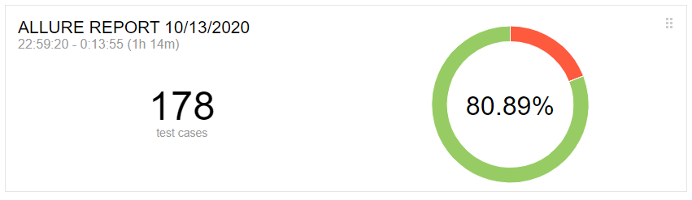
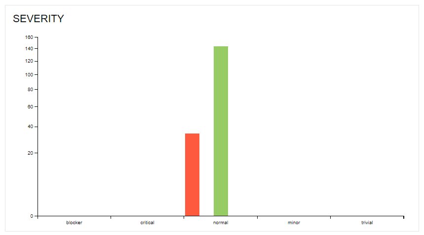
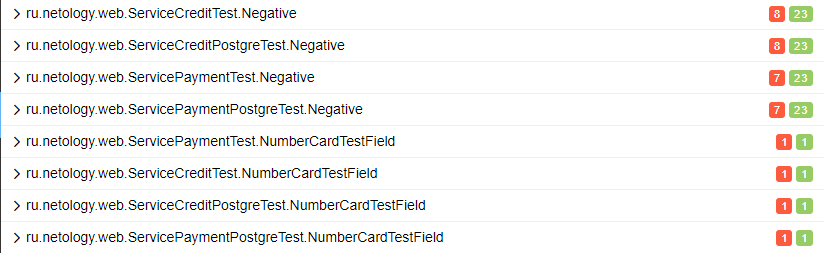
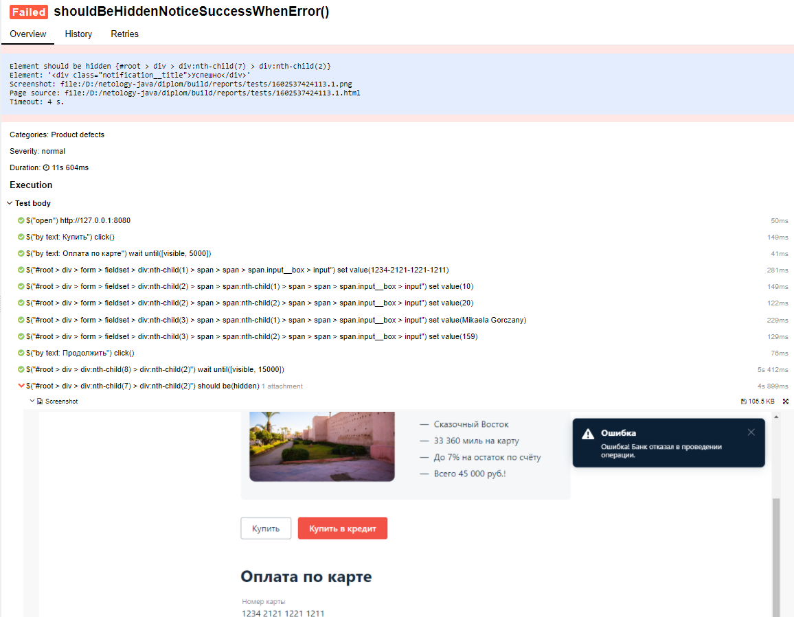

# Отчет итогу тестирования сервиса "Путешествие дня"

## Краткое описание
В ходе тестирования были проведены тесты на работу сервиса.
Проверка каждого из полей, заполняемых при совершении покупки, позволила выявить ряд ошибок.
По мимо проведения UI тестов, были проведены интеграционные тесты по работе приложения с базой данных MySQL/Postgre и api банка, которые так же позволили найти ошибки.

## Количество тест-кейсов:
Для проверки формы "Купить" было создано 45 тест-кейсов.
Для проверки формы "Купить в кредит" было создано 45 тест-кейсов.

## % успешных/не успешных тестов:  
  
> 

> 
дополнительные скриншоты:
  
> 
> 
>   
> 
> 
>   
> 
    

~ 80% успешных тестов  
~ 20% не успешных тестов  
Для каждой, из найденных ошибок были созданы баг-репорты, в которых описаны действия, при которых эти ошибки были найдены:  
- [Не должен позволять вводить спец символы в поле "Владелец"](https://github.com/venom4ek/diploma/issues/1)
- [Не должен совершать покупки при указанном сроке карты более 5 лет(60 месяцев)](https://github.com/venom4ek/diploma/issues/2)
- [Не должен разрешать совершать покупку при указании 00 месяца](https://github.com/venom4ek/diploma/issues/3)
- [Не должен разрешать ввод цифр в поле Владелец](https://github.com/venom4ek/diploma/issues/4)
- [Должен очищать все поля для ввода, после успешной отправки формы](https://github.com/venom4ek/diploma/issues/5)
- [Не должен разрешать вводить буквы русского алфавита в поле Владелец](https://github.com/venom4ek/diploma/issues/6)
- [Должен сообщать об ошибке при указании карты, по которой будет отказ Банка (4444 4444 4444 4442)](https://github.com/venom4ek/diploma/issues/7)
- [При отказе от банка, сообщение об успешной покупке не должно появляться(плавающая ошибка 1 из 3)](https://github.com/venom4ek/diploma/issues/8)
- [Сообщение об успешной отправке исчезает сразу после появления(плавающая ошибка)](https://github.com/venom4ek/diploma/issues/9)
- [При завершении/остановке сервиса записи в БД не должны удаляться](https://github.com/venom4ek/diploma/issues/10)
- [При успешной покупке в кредит, credit_id не должен быть NULL](https://github.com/venom4ek/diploma/issues/11)

## рекомендации
Рекомендуется устранить найденные проблемы в кратчайшие сроки, т.к. большинство из них имеют уровень серьезности от Major(значительная) до Critical(критическая). Назначить менеджера проекта для контроля устранения дефектов.  
Приоритет по устранению ошибок рекомендуется выставить для всех, кроме [9](https://github.com/venom4ek/diploma/issues/9), **Высокий**.  
Для ошибки [9](https://github.com/venom4ek/diploma/issues/9) Средний(Medium).